# MNIST Digit Recognizer
MNIST Digit Classication using Convolutional Neural Networks (CNN) and Regularization

My introduction to image classification, built and tested inside Google Colab using TensorFlow and Keras. The notebook showcases three progressively stronger models: a simple baseline model, simple CNN, and a regularized CNN. This README will highlight the final architecture as well as some of my design decisions.

## Data
The MNIST dataset consists of 28x28 gray-scale handwritten digits (0-9).
To load the dataset to your notebook, simply do:

```python
from tensorflow.keras.datasets import mnist
```
I split the original training set into **train** (90%), and **validation** (10%), plus the **test** set.
- **Train**: 54000
- **Validation**: 6000
- **Test**: 10000

---
## Environment and Tools
- **Platform:** Google Colab / Jupyter Notebook  
- **Language:** Python 3.7+  
- **Libraries:**  
  - NumPy  
  - Pandas  
  - Matplotlib  
  - Scikit-learn  
  - TensorFlow (Keras API)

---
## Installation
```bash
pip install --upgrade numpy pandas matplotlib scikit-learn tensorflow
```
---
## Model Progression

### 1. Baseline Model
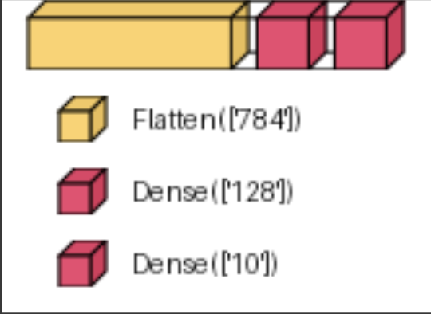
- **Layers**  
  1. **Flatten** (28×28×1 → 784)  
  2. **Dense** (128, ReLU)  
  3. **Dense** (10, Softmax)  
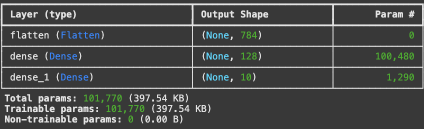
- **Validation Accuracy:** ~97.3% (5 epochs)
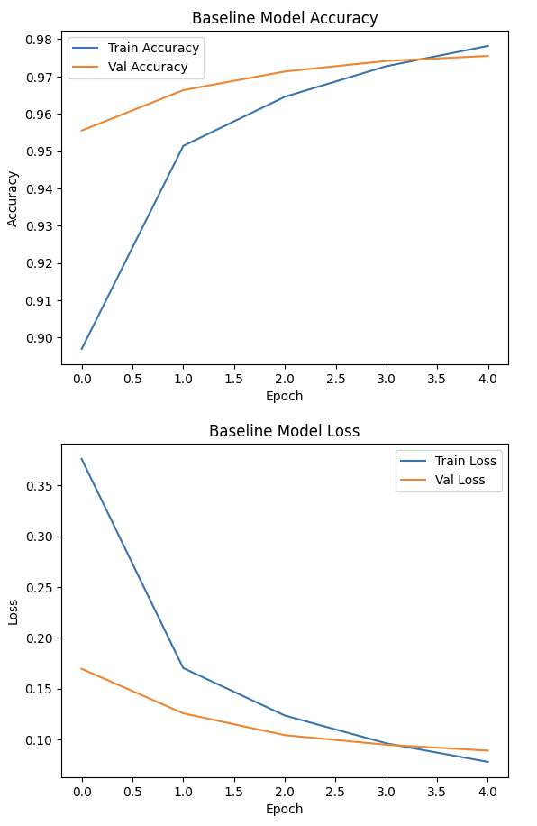

---
### 2. Simple CNN Model
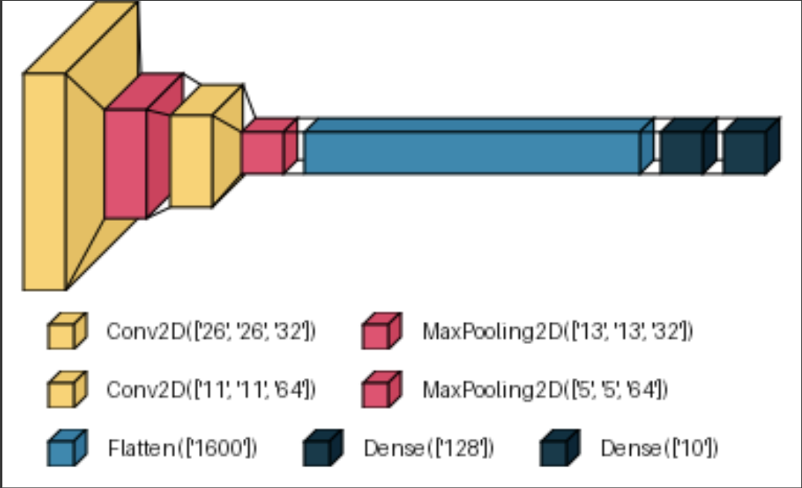
- **Layers**  
  1. **Conv2D** (32 × 3×3), ReLU → **MaxPooling2D** (2×2)  
  2. **Conv2D** (64 × 3×3), ReLU → **MaxPooling2D** (2×2)  
  3. **Flatten** (5×5×64 → 1600)  
  4. **Dense** (128, ReLU)  
  5. **Dense** (10, Softmax)  

- **Validation Accuracy:** ~99.0 % (10 epochs)
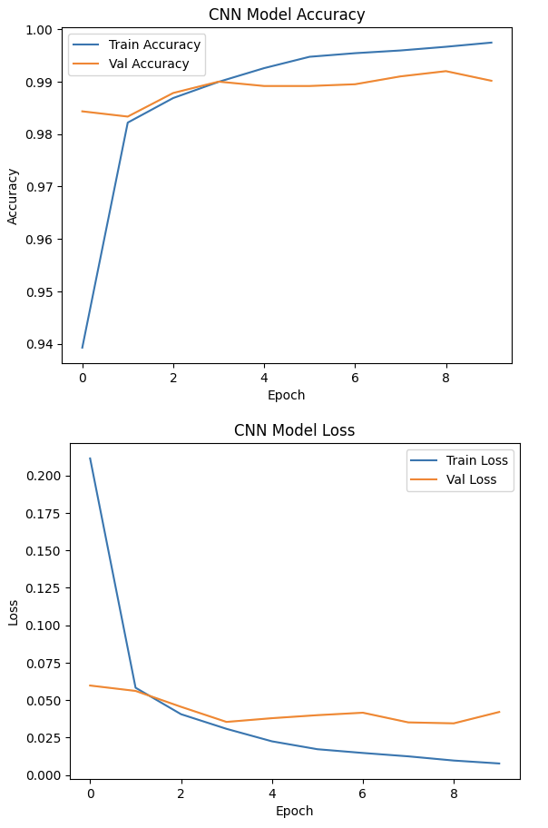
---
### 3. Regularized CNN Model
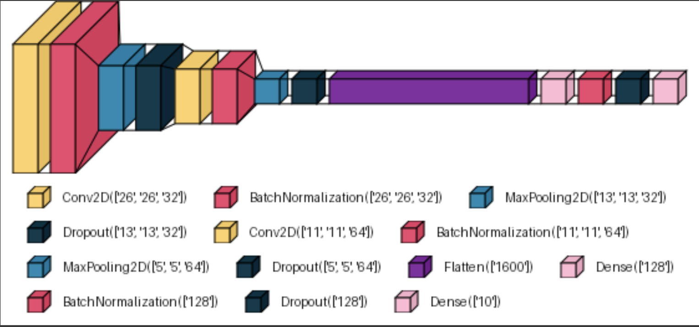
- **Layers & Shapes**  
  1. **Conv2D** (32 × 3×3) → **BatchNorm** → **MaxPool** (2×2) → **Dropout** (0.25)  
     - Output: 26×26×32  
  2. **Conv2D** (64 × 3×3) → **BatchNorm** → **MaxPool** (2×2) → **Dropout** (0.25)  
     - Output: 11×11×64 → 5×5×64  
  3. **Flatten** → **Dense** (128, ReLU) → **BatchNorm** → **Dropout** (0.5)  
  4. **Dense** (10, Softmax)  
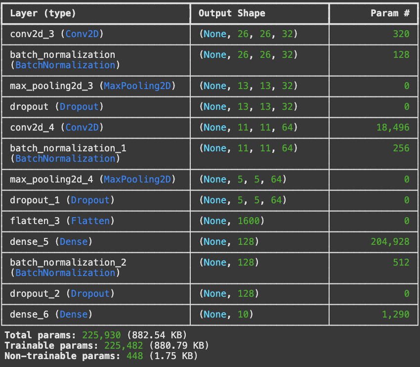
- **Validation Accuracy:** ~99.3 % (12 epochs)
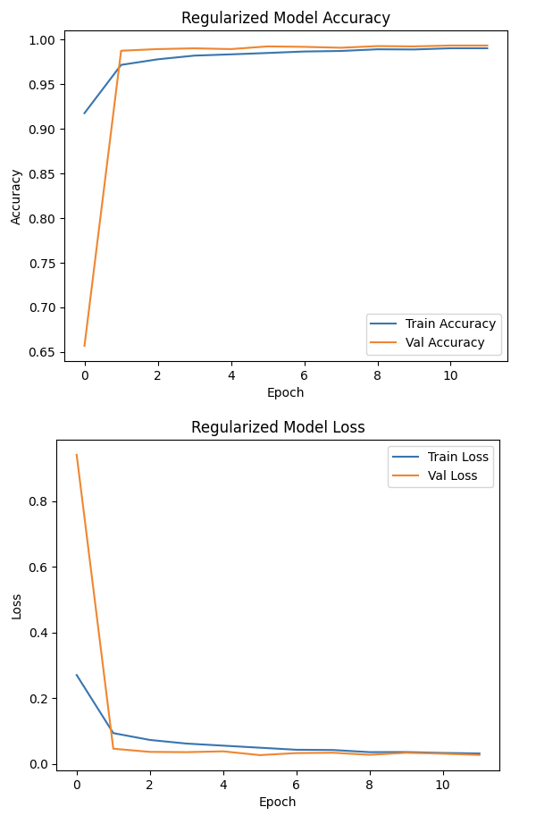

#### *CNN diagrams were generated using the visualkeras library
---

## Other Model Results
### Confusion Matrix
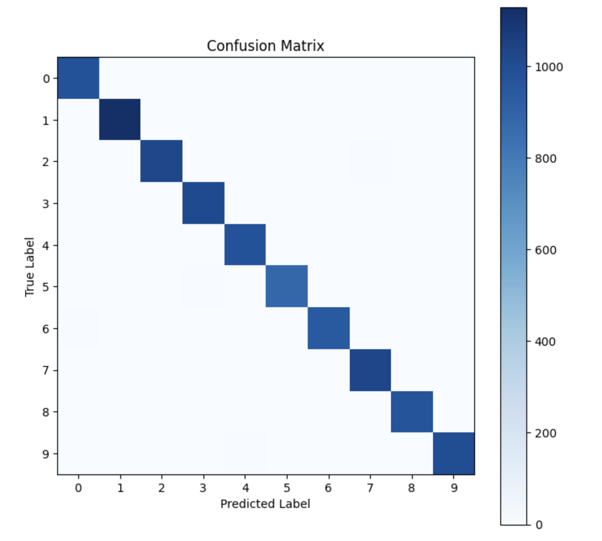

### Classification Report
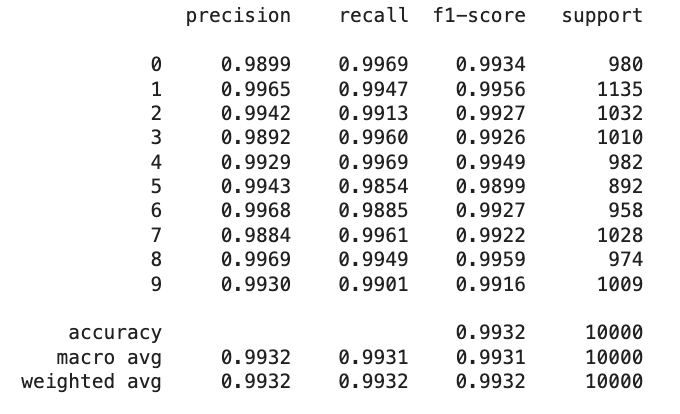

### Example Misclassifications
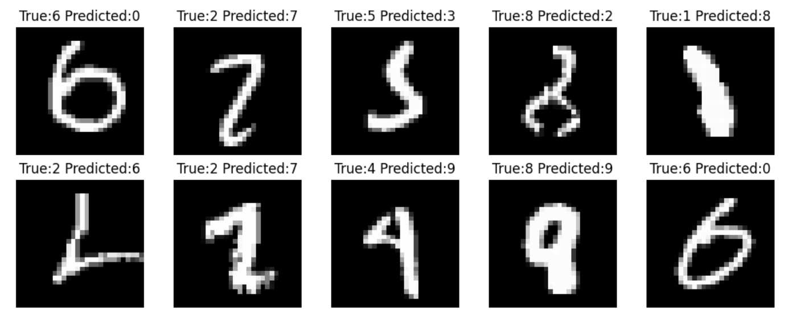

--- 

## Design Decisions
- **Small 3×3 Convolutional Filters**  
  Basically allows the network to learn edge patterns while keeping parameter counts low.

- **Two Conv–Pool Blocks**  
  - Block 1: 32 filters → spatial reduction 28→26→13  
  - Block 2: 64 filters → spatial reduction 13→11→5  
  Gradual downsampling preserves key features and adds translation invariance.

- **Batch Normalization After Every Nonlinearity**    
  - Speeds up convergence and allows use of higher learning rates

- **Dropout for Regularization**  
  - 25% after each conv–pool block to prevent co-adaptation of filters  
  - 50% before the final dense layer to regularize the embedding head

- **Moderate Dense Head (128 units)**  
  - Reduces overfitting compared to previous simple CNN model.

- **Adam Optimizer & Categorical Crossentropy**  
  - Helped me simplify tuning  

- **10 % Validation Split**  
  - Helped me to monitor overfitting, as evident in the simple CNN model

---

## Next Steps
I want to explore more about improving my CNN, and I saw some papers regarding transfer learning or using deeper networks (need to look into ResNet). An important thing I learned is that for continued progress in deep learning, we need more data, more compute, and better algorithms. A next step for this project would be to utilize ImageDataGenerator for data augmentation to synthetically expand the size of our training data to possibly increase the accuracy of my model above ~99.3%.

---

## References
https://medium.com/@lvarruda/how-to-get-top-2-position-on-kaggles-mnist-digit-recognizer-48185d80a2d4


  


